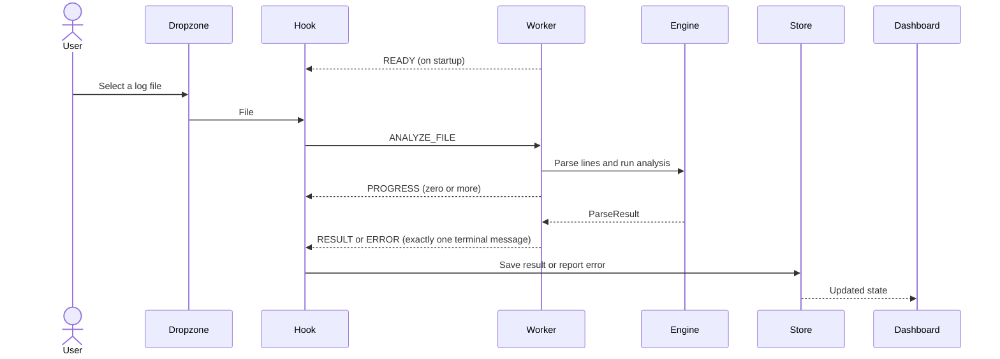

# Worker contract

The UI sends analysis work to the Web Worker. The worker sends progress and exactly one final result or error for each request ID. `READY` has no request ID because it announces that the worker has started.

| Message | Direction | When | Payload |
|---|---|---|---|
| `ANALYZE_FILE` | Hook → Worker | Analyze a selected file | `requestId`, `file`, `overrides`, `allowIps` |
| `ANALYZE_TEXT` | Hook → Worker | Analyze demo or sample text | `requestId`, `text`, `fileName`, `overrides`, `allowIps` |
| `CANCEL` | Hook → Worker | Cancel analysis | `requestId` |
| `READY` | Worker → Hook | Worker starts | `contractVersion` |
| `PROGRESS` | Worker → Hook | Analysis advances | `requestId`, `bytesRead`, `totalBytes`, `lines`, `skipped` |
| `RESULT` | Worker → Hook | Analysis succeeds; terminal | `requestId`, `result: ParseResult` |
| `ERROR` | Worker → Hook | Analysis fails or is cancelled; terminal | `requestId`, `code`, `message` |

## Rules

- Send `PROGRESS` at most once every 100 ms.
- Send exactly **one** terminal message (`RESULT` or `ERROR`) per `requestId`, including after cancellation.
- Ignore responses whose `requestId` is not currently known to the Hook. `READY` is the exception because it has no request ID.
- Messages use structured clone. Do not include functions in any message payload.
- `ParseResult.entries` contains no more than 20,000 entries.
- The shared message types are in `src/contracts/messages.ts`. Shared data types are in `src/contracts/index.ts`.
- `src/contracts/jsonSchema/parse-result.schema.json` documents the `ParseResult` shape and the entry limit for exported JSON.
